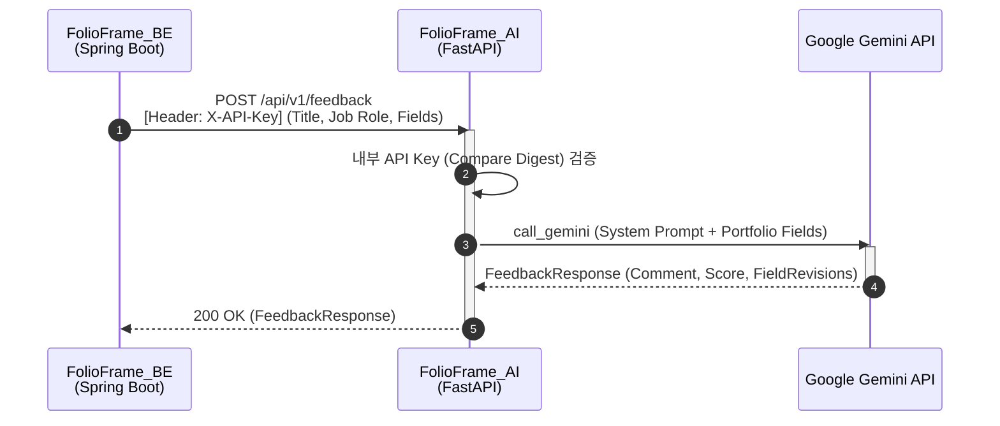

# FolioFrame AI Server
> **Google Gemini 2.5 Flash 기반 포트폴리오 피드백 및 문장 첨삭 서비스**

[](https://www.python.org/)
[](https://fastapi.tiangolo.com/)
[](https://deepmind.google/technologies/gemini/)
[](https://www.docker.com/)
[](https://github.com/features/actions)

---

## 📌 Project Overview
**FolioFrame AI Server**는 포트폴리오 제작 플랫폼 **FolioFrame**의 AI 핵심 기능을 담당하는 FastAPI 기반 마이크로서비스입니다.

사용자가 작성한 포트폴리오의 각 필드(한 줄 소개, 상세 설명, 프로젝트 요약, 커스텀 필드 등)를 분석하여 문법과 맞춤법을 맞추고, 시니어 커리어 컨설턴트 톤으로 작성된 상세 피드백 코멘트와 5대 역량 기반 종합 점수 및 첨삭 텍스트를 제공합니다.

---

## 🎯 핵심 가치

| 가치 | 설명 |
| :--- | :--- |
| **AI 포트폴리오 첨삭** | 시니어 컨설턴트 관점에서 포트폴리오의 부족한 부분을 메우고 자연스러운 문장으로 재구성 |
| **5대 역량 평가 모델** | 구체성, 정량적 성과, 논리적 흐름, 직무 연관성, 가독성을 정밀 평가하여 점수(0~100) 도출 |
| **컨텍스트 기반 최적화** | 지원 직군(job_role) 및 필드 성격에 맞춰 IT 전문 어휘 적용 및 맞춤형 피드백 생성 |
| **신속·안전한 내부 API** | Spring Boot 메인 백엔드와의 안전한 통신을 위해 내부 API Key 검증 아키텍처 도입 |

---

## 🏗️ Architecture



```
FolioFrame_BE (Spring Boot) ───[POST /api/v1/feedback (X-API-Key)]───→ FolioFrame_AI (FastAPI)
                                                                            │
                                                                   [Gemini 2.5 Flash]
                                                                            │
FolioFrame_BE (Spring Boot) ←─────────[200 OK (Feedback Response)]──────────┘
```
> FolioFrame 메인 백엔드(Spring Boot)가 API Key 헤더를 실어 첨삭 요청을 보내면, FastAPI 서버가 API Key 검증을 거친 후 Gemini API를 호출하여 구조화된 피드백 리포트 및 교정 문장을 동기적으로 즉시 반환합니다.

---

## ⚡ Key Features

### 1. 🤖 Gemini AI 포트폴리오 첨삭 및 평가
- **총평 및 종합 점수 생성**: 각 평가 항목(구체성, 정량적 성과, 논리적 흐름, 직무 연관성, 표현력/가독성)의 세부 배점 기준에 따라 공정하게 채점하고, 우선순위 높은 보완 방향을 제시하는 총평(comment) 작성
- **맞춤형 문장 재구성**: 포트폴리오/프로필 한 줄 소개, 상세 설명, 프로젝트 요약 등의 가이드라인에 맞춰 격식체 존댓말로 자동 변환 및 가독성 극대화
- **할루시네이션 방지**: 원문에 없는 숫자나 기술 스택을 임의로 위조 및 조작하지 않도록 설계된 엄격한 시스템 지침 적용

### 2. 🛡️ API 호출 안정성 및 복원력
- **Exponential Backoff 재시도**: 일시적 네트워크 오류나 API 서버 지연 시 최대 3회 재시도 동작 (`httpx`, `google-genai` 비동기 클라이언트 연동)
- **할당량 초과 핸들링**: Rate Limit(`RESOURCE_EXHAUSTED` / 429 에러) 발생 시 커스텀 예외(`GeminiQuotaExceededError`)를 통해 클라이언트에 명확한 한도 초과 에러 전달
- **정밀 스키마 매핑**: Gemini의 `response_schema` 옵션을 사용해 Pydantic 모델 구조로 직접 응답을 추출하여 JSON 파싱 누수 차단

### 3. 🔑 보안 및 연동 최적화
- **내부 API 인증**: `X-API-Key` 헤더와 환경변수 `AI_SERVICE_API_KEY`를 `secrets.compare_digest` 방식으로 대조 검증하여 타이밍 공격 무력화
- **타입 안정성**: Pydantic v2 기반의 강력한 필드 값 검증 및 데이터 모델 정규화

---

## 🛠️ Tech Stack

| Category | Stack |
| :--- | :--- |
| **Runtime** | Python 3.12 |
| **Framework** | FastAPI, Uvicorn |
| **AI** | Google Gemini SDK (genai v1.0+), Gemini 2.5 Flash |
| **Validation** | Pydantic v2, Pydantic Settings |
| **HTTP Client** | HTTPX |
| **Test** | pytest, pytest-asyncio |
| **Infra** | Docker, GitHub Actions |

---

## 📂 Project Structure

```
app/
├── core/
│   ├── config.py         # Settings 환경설정 (.env 로드 및 검증)
│   └── security.py       # API Key 보안 인증 모듈 (BE-AI 간 인증)
├── errors/
│   ├── exceptions.py     # 커스텀 예외 정의 (GeminiError 등)
│   └── handlers.py       # 전역 Exception Handler 등록
├── routers/
│   └── feedback.py       # 피드백 제공 API 엔드포인트 (/api/v1/feedback)
├── schemas/
│   └── feedback.py       # Request/Response Pydantic 데이터 모델
├── services/
│   └── gemini_service.py # Gemini API 연동 및 피드백 프롬프트 비즈니스 로직
└── main.py               # FastAPI 어플리케이션 진입점 및 Lifespan 제어
tests/
├── conftest.py           # pytest fixture 및 비동기 환경 설정
├── test_feedback_api.py  # API 엔드포인트 연동 테스트
└── test_gemini_service.py# Gemini 서비스 단위 테스트
```

---

## 📖 API Endpoints

| Method | Endpoint | Description | Auth (Header) |
| :--- | :--- | :--- | :--- |
| **POST** | `/api/v1/feedback` | 포트폴리오 피드백 및 첨삭 리포트 생성 | `X-API-Key` |
| **GET** | `/health` | Docker 및 로드밸런서용 헬스체크 | 없음 |

---

## 🚀 Getting Started

### Prerequisites
- Python 3.12+
- Git

### Setup
1. **저장소 클론**
   ```bash
   git clone https://github.com/FolioFrame-v2/AI.git
   cd AI
   ```
2. **가상환경 생성 및 활성화**
   ```bash
   python -m venv .venv
   source .venv/Scripts/activate  # Windows (Git Bash 등)
   # macOS/Linux: source .venv/bin/activate
   ```
3. **의존성 설치**
   ```bash
   pip install -r requirements.txt
   ```
4. **환경 변수 설정**
   ```bash
   cp .env.example .env
   # 생성된 .env 파일 내부의 API 키 설정 진행
   ```

### Run
- **개발 모드 (Hot Reload)**
  ```bash
  uvicorn app.main:app --reload --port 8000
  ```

### Test
- **단위 및 통합 테스트 실행**
  ```bash
  pip install -r requirements-dev.txt
  pytest
  ```

### Docker
```bash
docker build -t folioframe-ai .
docker run -p 8000:8000 --env-file .env folioframe-ai
```

---

<p align="center">
  FolioFrame AI · Built with 🐍 by FolioFrame Team
</p>
